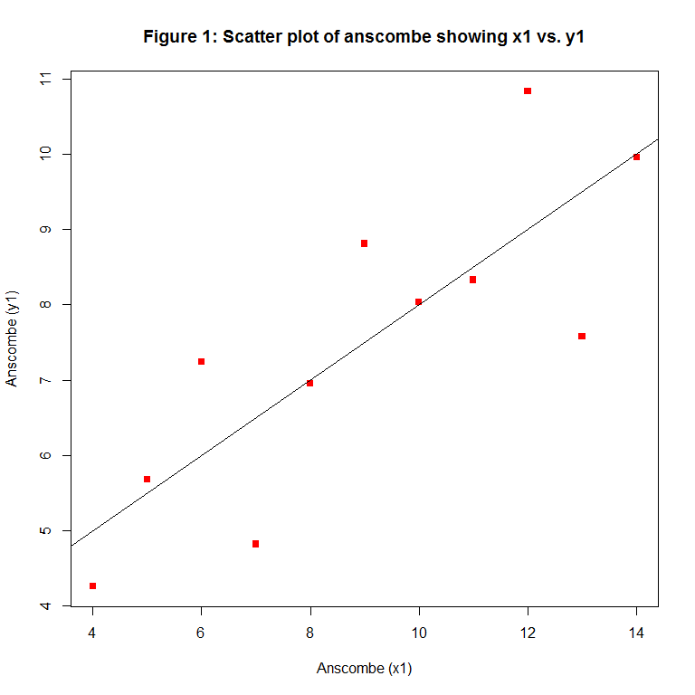
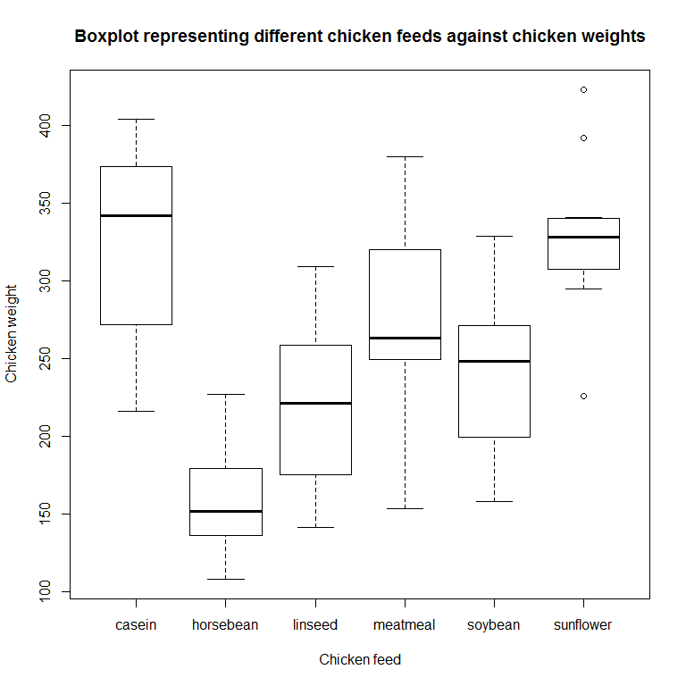
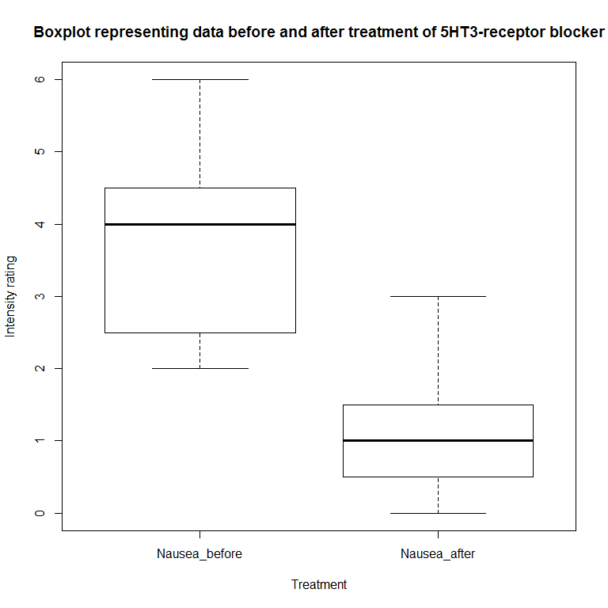

Practise Assignment
================
Vishaylin J. Mahadeo
August 30, 2016

Part 1
======

Hello Octocat
-------------

I love Octocat. She's the coolest cat in town. ! [](https://dl.dropboxusercontent.com/u/11805474/painblogr/biostats/images/octocat.png)

Part 2
======

``` r
#load data set
data("anscombe")

#column titles
names(anscombe)
```

    ## [1] "x1" "x2" "x3" "x4" "y1" "y2" "y3" "y4"

``` r
#show dimensions of data set rows vs. columns
dim(anscombe)
```

    ## [1] 11  8

``` r
#show first 6 rows
head(anscombe, 6)
```

    ##   x1 x2 x3 x4   y1   y2    y3   y4
    ## 1 10 10 10  8 8.04 9.14  7.46 6.58
    ## 2  8  8  8  8 6.95 8.14  6.77 5.76
    ## 3 13 13 13  8 7.58 8.74 12.74 7.71
    ## 4  9  9  9  8 8.81 8.77  7.11 8.84
    ## 5 11 11 11  8 8.33 9.26  7.81 8.47
    ## 6 14 14 14  8 9.96 8.10  8.84 7.04

``` r
#show last 6 rows
tail(anscombe, 6)
```

    ##    x1 x2 x3 x4    y1   y2   y3    y4
    ## 6  14 14 14  8  9.96 8.10 8.84  7.04
    ## 7   6  6  6  8  7.24 6.13 6.08  5.25
    ## 8   4  4  4 19  4.26 3.10 5.39 12.50
    ## 9  12 12 12  8 10.84 9.13 8.15  5.56
    ## 10  7  7  7  8  4.82 7.26 6.42  7.91
    ## 11  5  5  5  8  5.68 4.74 5.73  6.89

``` r
#summary statistics for each column
summary(anscombe)
```

    ##        x1             x2             x3             x4    
    ##  Min.   : 4.0   Min.   : 4.0   Min.   : 4.0   Min.   : 8  
    ##  1st Qu.: 6.5   1st Qu.: 6.5   1st Qu.: 6.5   1st Qu.: 8  
    ##  Median : 9.0   Median : 9.0   Median : 9.0   Median : 8  
    ##  Mean   : 9.0   Mean   : 9.0   Mean   : 9.0   Mean   : 9  
    ##  3rd Qu.:11.5   3rd Qu.:11.5   3rd Qu.:11.5   3rd Qu.: 8  
    ##  Max.   :14.0   Max.   :14.0   Max.   :14.0   Max.   :19  
    ##        y1               y2              y3              y4        
    ##  Min.   : 4.260   Min.   :3.100   Min.   : 5.39   Min.   : 5.250  
    ##  1st Qu.: 6.315   1st Qu.:6.695   1st Qu.: 6.25   1st Qu.: 6.170  
    ##  Median : 7.580   Median :8.140   Median : 7.11   Median : 7.040  
    ##  Mean   : 7.501   Mean   :7.501   Mean   : 7.50   Mean   : 7.501  
    ##  3rd Qu.: 8.570   3rd Qu.:8.950   3rd Qu.: 7.98   3rd Qu.: 8.190  
    ##  Max.   :10.840   Max.   :9.260   Max.   :12.74   Max.   :12.500

Part 3
======

``` r
#load data set
data("anscombe")

#scatter plot (with axis titles, red, and squares)
graph <- plot(x = anscombe$x1, y = anscombe$y1,
     main = 'Figure 1: Scatter plot of anscombe showing x1 vs. y1',
     xlab = 'Anscombe (x1)',
     ylab = 'Anscombe (y1)',
     pch = 15 ,
     col = 2 ,
     lty = 2)

#regression line
regline <- lm(y1 ~ x1, data = anscombe)
abline(regline)
```



Part 4
======

``` r
#load data set
df_analgesic <- read_csv('analgesic.csv')
```

``` r
#dimensions of data set
dim(df_analgesic)
```

    ## [1] 40  5

``` r
#names of column titles
names(df_analgesic)
```

    ## [1] "ID"            "Group"         "Measurement_1" "Measurement_2"
    ## [5] "Measurement_3"

``` r
#first 6 rows of data set
head(df_analgesic)
```

    ## # A tibble: 6 x 5
    ##      ID     Group Measurement_1 Measurement_2 Measurement_3
    ##   <int>     <chr>         <int>         <int>         <int>
    ## 1     1 Analgesic            26            26            21
    ## 2     2 Analgesic            29            26            23
    ## 3     3 Analgesic            24            28            22
    ## 4     4 Analgesic            25            22            24
    ## 5     5 Analgesic            24            28            23
    ## 6     6 Analgesic            22            23            26

``` r
#last 6 rows of data set
tail(df_analgesic)
```

    ## # A tibble: 6 x 5
    ##      ID   Group Measurement_1 Measurement_2 Measurement_3
    ##   <int>   <chr>         <int>         <int>         <int>
    ## 1    35 Placebo            17            21            15
    ## 2    36 Placebo            19            17            15
    ## 3    37 Placebo            14            19            13
    ## 4    38 Placebo            17            19            13
    ## 5    39 Placebo            11            20            18
    ## 6    40 Placebo            15            18            12

``` r
#summary statistics for each column
summary(df_analgesic)
```

    ##        ID           Group           Measurement_1   Measurement_2 
    ##  Min.   : 1.00   Length:40          Min.   :10.00   Min.   : 8.0  
    ##  1st Qu.:10.75   Class :character   1st Qu.:17.00   1st Qu.:17.0  
    ##  Median :20.50   Mode  :character   Median :20.00   Median :20.0  
    ##  Mean   :20.50                      Mean   :20.12   Mean   :20.7  
    ##  3rd Qu.:30.25                      3rd Qu.:24.00   3rd Qu.:25.0  
    ##  Max.   :40.00                      Max.   :30.00   Max.   :32.0  
    ##  Measurement_3  
    ##  Min.   :12.00  
    ##  1st Qu.:16.00  
    ##  Median :20.50  
    ##  Mean   :20.52  
    ##  3rd Qu.:24.25  
    ##  Max.   :30.00

``` r
#gather data from wide to long format
gathered <- gather(data = df_analgesic ,
                   key = measurements ,
                   value = data, Measurement_1:Measurement_3)

#group by individuals
by_id <- group_by(gathered, ID)
by_id
```

    ## Source: local data frame [120 x 4]
    ## Groups: ID [40]
    ## 
    ##       ID     Group  measurements  data
    ##    <int>     <chr>         <chr> <int>
    ## 1      1 Analgesic Measurement_1    26
    ## 2      2 Analgesic Measurement_1    29
    ## 3      3 Analgesic Measurement_1    24
    ## 4      4 Analgesic Measurement_1    25
    ## 5      5 Analgesic Measurement_1    24
    ## 6      6 Analgesic Measurement_1    22
    ## 7      7 Analgesic Measurement_1    25
    ## 8      8 Analgesic Measurement_1    28
    ## 9      9 Analgesic Measurement_1    22
    ## 10    10 Analgesic Measurement_1    18
    ## # ... with 110 more rows

``` r
#summarise and calculate mean
report <- summarize(by_id, mean(data))
report
```

    ## # A tibble: 40 x 2
    ##       ID mean(data)
    ##    <int>      <dbl>
    ## 1      1   24.33333
    ## 2      2   26.00000
    ## 3      3   24.66667
    ## 4      4   23.66667
    ## 5      5   25.00000
    ## 6      6   23.66667
    ## 7      7   26.66667
    ## 8      8   23.33333
    ## 9      9   22.66667
    ## 10    10   24.00000
    ## # ... with 30 more rows

Part 5
======

Chicken Weights
---------------

``` r
#load data set(chicken weights)
df_chicken <- read_csv('chick-weights.csv')
boxplot(weight ~ feed, data = df_chicken,
        main = 'Boxplot representing different chicken feeds against chicken weights',
        xlab = 'Chicken feed', ylab = 'Chicken weight')
```



**Null hypothesis:** Type of chicken feed has no effect on chicken weights.

**Alternative hypothesis:** Type of chicken feed does have an effect on chicken weights.

**Assumptions:**

1.  a = 0.05

2.  Unpaired data.

3.  Normally distributed, hence Parametric data set.

4.  Therefore One-way ANOVA required to test hypothesis.

5.  Reject null hypothesis if p &lt; a

``` r
#One way ANOVA test
chicken_test <- aov(weight ~ feed, data = df_chicken)
summary(chicken_test)
```

    ##             Df Sum Sq Mean Sq F value   Pr(>F)    
    ## feed         5 231129   46226   15.37 5.94e-10 ***
    ## Residuals   65 195556    3009                     
    ## ---
    ## Signif. codes:  0 '***' 0.001 '**' 0.01 '*' 0.05 '.' 0.1 ' ' 1

``` r
#post-hoc test (Pairwise)
chicken_posthoc <- pairwise.t.test(df_chicken$weight, df_chicken$feed , 
                                   p.adjust.method = 'holm' ,
                                   paired = FALSE)
chicken_posthoc
```

    ## 
    ##  Pairwise comparisons using t tests with pooled SD 
    ## 
    ## data:  df_chicken$weight and df_chicken$feed 
    ## 
    ##           casein  horsebean linseed meatmeal soybean
    ## horsebean 2.9e-08 -         -       -        -      
    ## linseed   0.00016 0.09435   -       -        -      
    ## meatmeal  0.18227 9.0e-05   0.09435 -        -      
    ## soybean   0.00532 0.00298   0.51766 0.51766  -      
    ## sunflower 0.81249 1.2e-08   8.1e-05 0.13218  0.00298
    ## 
    ## P value adjustment method: holm

``` r
#make a vector of p-values from each of planned comparisons
p <- c('[test 1]' = 0.001, '[Test 2]' = 0.211, '[Test 3]' = 0.013)
chicken_adjust <- p.adjust(p, method = 'holm')
chicken_adjust
```

    ## [test 1] [Test 2] [Test 3] 
    ##    0.003    0.211    0.026

F (15.37) = 5.94e^-10; p = 0. Therefore reject null hypothesis, and accept alternative.

**Conclusion:**Type of chicken feed does affect chicken weights.

The Hot Zone
------------

``` r
#load data set (hot_zone)
df_hot <- read_csv('gastroenteritis.csv')
head(df_hot)
```

    ## # A tibble: 6 x 2
    ##       Consumption Outcome
    ##             <chr>   <chr>
    ## 1 < 1 glasses/day     ill
    ## 2 < 1 glasses/day     ill
    ## 3 < 1 glasses/day     ill
    ## 4 < 1 glasses/day     ill
    ## 5 < 1 glasses/day     ill
    ## 6 < 1 glasses/day     ill

``` r
#Tabulate data set
hot_table <- table(df_hot$Consumption, df_hot$Outcome)
print(hot_table)
```

    ##                     
    ##                      ill not ill
    ##   < 1 glasses/day     39     121
    ##   > 4 glasses/day    265     146
    ##   1 to 4 glasses/day 265     258

``` r
#Cross-tabulate data set
hot_cross <- xtabs(~Consumption + Outcome, data = df_hot)
print(hot_cross)
```

    ##                     Outcome
    ## Consumption          ill not ill
    ##   < 1 glasses/day     39     121
    ##   > 4 glasses/day    265     146
    ##   1 to 4 glasses/day 265     258

**Null Hypothesis:** Drinking contaminated water does not cause gastroenteritis.

**Alternative Hypothesis:** Drinking contaminated water does cause gasteroenteritis.

**Assumptions:**

1.  a = 0.05

2.  Unpaired data set.

3.  Non-parametric.

4.  Therefore Chi squared test is required to test hypothesis.

5.  Reject null nypothesis if p &lt; a.

``` r
#Pearson Chi squared test
hot_test <- chisq.test(hot_table, correct = FALSE)
hot_test
```

    ## 
    ##  Pearson's Chi-squared test
    ## 
    ## data:  hot_table
    ## X-squared = 74.925, df = 2, p-value < 2.2e-16

X-squared (2, n=1094)= 74.925; p &lt; 2.2e-16. Therefore reject null hypothesis and accept alternative.

**Conclusion:** Drinking contaminated water does cause gastroenteritis.

Nausea
------

``` r
#load data set
df_nausea <- read_csv('nausea.csv')
print(df_nausea)
```

    ## # A tibble: 8 x 3
    ##   Patient Nausea_before Nausea_after
    ##     <int>         <int>        <int>
    ## 1       1             3            2
    ## 2       2             4            0
    ## 3       3             6            1
    ## 4       4             2            3
    ## 5       5             2            1
    ## 6       6             4            1
    ## 7       7             5            0
    ## 8       8             6           40

``` r
#exclude outlier
nausea_new <- df_nausea[-8, -1]
print(nausea_new)
```

    ## # A tibble: 7 x 2
    ##   Nausea_before Nausea_after
    ##           <int>        <int>
    ## 1             3            2
    ## 2             4            0
    ## 3             6            1
    ## 4             2            3
    ## 5             2            1
    ## 6             4            1
    ## 7             5            0

``` r
#plot data set
boxplot(nausea_new, 
        main = 'Boxplot representing data before and after treatment of 5HT3-receptor blocker',
        xlab = 'Treatment', ylab = 'Intensity rating')
```

 **Null Hypothesis:** The 5HT3-receptor blocker does not affect intensity of nausea.

**Alternative Hypothesis:** The 5HT3-receptor blocker does affect intensity of nausea.

**Assumptions:**

1.  a = 0.05

2.  Paired, ordinal data set

3.  Parametric.

4.  Therfore a Wilcox test is required to test hypothesis.

5.  Reject null hypothesis if p &lt; a.

``` r
#Students t-test
nausea_test <- wilcox.test(nausea_new$Nausea_before, nausea_new$Nausea_after,
                           paired = TRUE)
nausea_test
```

    ## 
    ##  Wilcoxon signed rank test with continuity correction
    ## 
    ## data:  nausea_new$Nausea_before and nausea_new$Nausea_after
    ## V = 26, p-value = 0.04983
    ## alternative hypothesis: true location shift is not equal to 0

p = 0.04983, therefore reject null hypothesis and accept alternative.

**Conclusion:** The 5HT3-receptor blocker does affect intensity of nausea.
